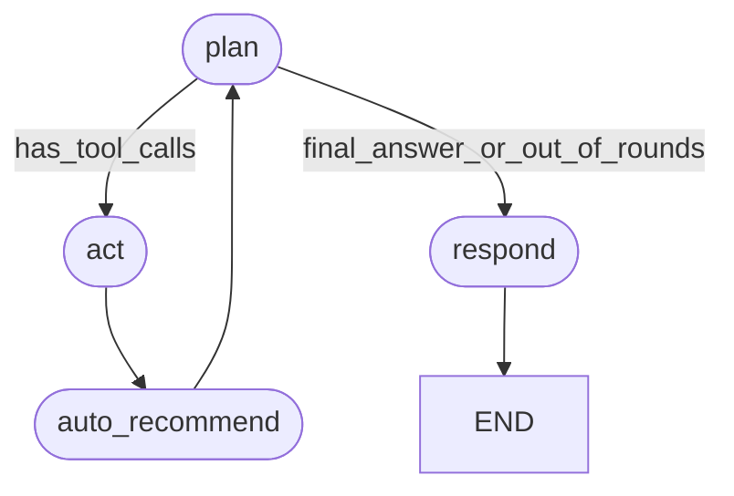

# Flight Search & Tracking Agent

Standalone agent (independent of `starter_v0/`) implementing the spec in the
root `CLAUDE.md`: airport lookup, one-way/round-trip price search, flight
status tracking, airport arrivals/departures, offer comparison, price-history
analysis, and price/status watches. It only searches and monitors — it never
books or pays for anything.

## Architecture

```
adapters/            thin wrappers over the two external APIs (URL/response shape isolated here)
  flightapi_adapter.py    FlightAPI.io: airport/airline code lookup, one-way + round-trip price search
  aerodatabox_adapter.py  AeroDataBox (RapidAPI): flight status, airport FIDS (arrivals/departures), airport search/lookup
store.py             JSON-file persistence: price history + watches (no DB needed at this scale)
tools/                the 10 tools from CLAUDE.md §4, plus get_current_time, each a plain function returning a dict
  schemas.py              OpenAI-style function-calling declarations for all 11 tools
providers/            OpenAI-compatible chat-completions clients (OpenAI and OpenRouter), via `requests`
graph.py              dependency-free graph-agent engine (nodes + conditional edges over shared state)
agent.py              the agent's graph definition (see below) built on graph.py
chat.py               interactive CLI, logs each session to transcripts/*.json
check_watches.py      run this (manually or on a schedule) to evaluate watches and print alerts
artifacts/system_prompt.md   the rules the agent follows (CLAUDE.md §8, encoded)
```

### Graph agent

The agent is a graph, not a single loop — four nodes connected by conditional
edges over a shared state dict (`graph.py:StateGraph`, `agent.py:build_graph`):



- **plan** — the LLM decides: call tool(s), or answer directly.
- **act** — executes whatever tool calls `plan` returned.
- **auto_recommend** — a *deterministic* rule node, not an LLM decision: if
  `act` just ran `search_flight_prices` and got 2+ offers, and nothing has
  called `compare_flight_offers` yet this turn, it forces that call. This
  guarantees CLAUDE.md §5's 3-pick recommendation logic actually runs,
  instead of depending on the model remembering to call it (it doesn't
  always — this was a real gap observed in testing before this node existed).
- **respond** — finalizes the assistant's answer; terminal node.

Two more anti-hallucination guardrails live at the code level, not just in
the prompt (a real gap observed in testing: the model would sometimes state
a wrong "today" or reuse/guess an airport code instead of calling the tool
that verifies it):
- Every turn, `run_turn` injects a fresh `[time grounding]` system message
  (current UTC + Vietnam/Asia-Ho_Chi_Minh time, via the new `get_current_time`
  tool/function) right before `plan` runs, so relative dates ("ngày mai",
  "tuần sau") are always resolved against the real clock, not the model's
  guess.
- `execute_tool_call` rejects `search_flight_prices` / `get_airport_arrivals`
  / `get_airport_departures` / `create_price_watch` calls whose
  origin/destination/airport_code hasn't already been returned by a
  `search_airports` call earlier in the conversation (scanned from message
  history), with a tool-error result telling the model to verify first.

Every turn's `graph_trace` (the sequence of node names visited, e.g.
`['plan', 'act', 'auto_recommend', 'plan', 'respond']`) is saved in
`transcripts/*.transcript.json`, so which path the graph took each turn is
inspectable evidence, not just the final answer.

## Setup

```bash
cd flight_agent
python -m venv .venv
.venv\Scripts\activate        # Windows
# source .venv/bin/activate   # macOS/Linux
pip install -r requirements.txt
copy .env.example .env        # Windows; `cp` on macOS/Linux
```

Fill in `.env`:
- `FLIGHTAPI_KEY` — from flightapi.io. Note: this project's key only has
  access to the price-search endpoints (`/onewaytrip`, `/roundtrip`); its
  `/iata` airport-lookup endpoint returned 401 (plan-gated). `search_airports`
  therefore uses AeroDataBox as its primary source, with FlightAPI tried as a
  best-effort secondary that's silently skipped if it errors.
- `RAPIDAPI_KEY` + `RAPIDAPI_AERODATABOX_HOST` — AeroDataBox via RapidAPI.
- One model provider key: `OPENAI_API_KEY` (native OpenAI) or
  `OPENROUTER_API_KEY` (OpenRouter). If both are set, OpenAI is used.

Never commit `.env` — it's gitignored.

## Run

```bash
python chat.py
```

Each turn prints the tool calls the model made (name + args) before the
final answer, so tool use is visible. Type `/exit` to quit. A transcript is
saved to `transcripts/`.

```bash
python check_watches.py
```

Evaluates every active watch against fresh data and prints an alert only on
a genuine threshold cross or state transition (never a repeat for an
unchanged price/status). There's no push-notification channel wired up (no
email/SMS/Telegram credentials in scope) — this is meant to be run manually
or wired into a scheduler (cron / Task Scheduler) for periodic checks.

## Tools

| Tool | Source | Notes |
|---|---|---|
| `get_current_time` | local (system clock) | Real UTC + Vietnam (Asia/Ho_Chi_Minh) time; also auto-injected every turn so the model never guesses "today" |
| `search_airports` | AeroDataBox (primary), FlightAPI (fallback) | Verifies IATA/ICAO codes; never guess a code — enforced by `execute_tool_call`, not just the prompt |
| `search_flight_prices` | FlightAPI.io | One-way/round-trip; logs a price-history point per call |
| `get_flight_status` | AeroDataBox | By flight number, optional date |
| `get_airport_departures` / `get_airport_arrivals` | AeroDataBox | Local time window, max 12h/call (provider limit). Pass explicit `from_local`/`to_local` for a future date — the default "now" window can 429 on this API plan's live-board tier; a future window works fine (verified). |
| `compare_flight_offers` | local | Ranks a prior `search_flight_prices` result into up to 3 picks: cheapest / most_convenient / balanced. Makes no API call. |
| `analyze_price_history` | local | Stats (min/max/avg/median/% change/best date) over locally logged price checks for a route/date |
| `create_price_watch` / `create_flight_status_watch` / `cancel_watch` | local | Registers/cancels a watch; `check_watches.py` evaluates it |

## Known limitations

- No real notification channel (email/SMS/push) — `check_watches.py` prints
  to stdout. Wiring one in is straightforward (the alert strings are already
  built) but wasn't part of this project's scope.
- `data/*.json` (price history, watches) is a flat JSON file, single-writer —
  fine for one local user, not for concurrent access.
- FlightAPI's price-search response schema isn't fully documented publicly;
  `adapters/flightapi_adapter.normalize_offers` parses it defensively and
  reports `unparsed_count` for any itinerary it couldn't confidently map,
  rather than guessing.
